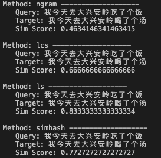

# text_string_similarity
文本字符相似度计算


## Info
适合于需要计算文本字符字面量相似度的场景。


## Model
- Ngram+Jaccard
- LCS(Longest Common Substring)
- 编辑距离
- Simhash

## Requirements
```
simhash==2.1.2
python-Levenshtein==0.12.2
```

## Demo



## Get Start
```
python sim.py
```


